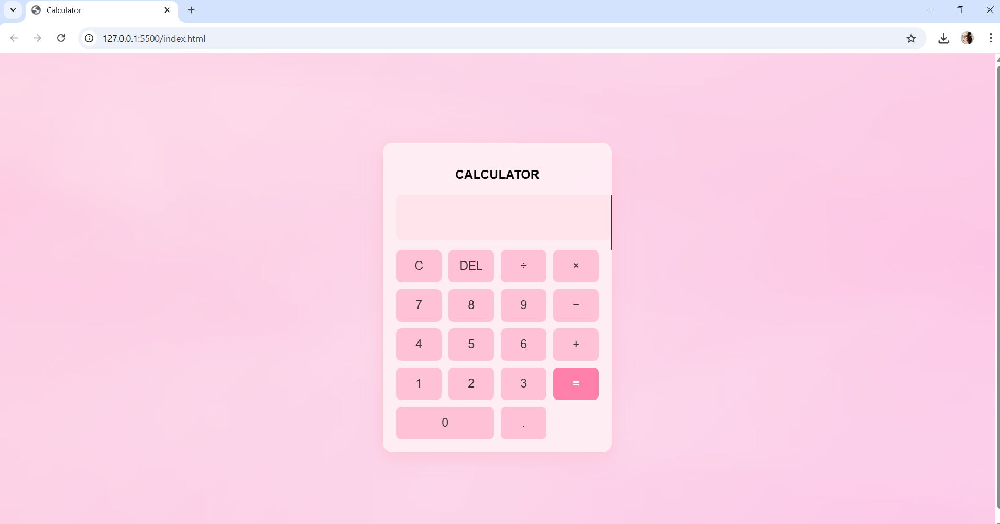

# CALCULATOR
🧮 Simple Calculator App (AngularJS) A lightweight and responsive calculator built using AngularJS, HTML, and CSS. This app performs basic arithmetic operations with a clean UI and real-time updates powered by AngularJS data binding. 
🚀 Features Basic operations: 
    Addition, Subtraction, Multiplication, Division 
    Smooth and instant result display 
    Clean and responsive calculator layout 
    User-friendly interface with buttons 
    Keyboard input support 
    Beginner-friendly AngularJS code structure

  

